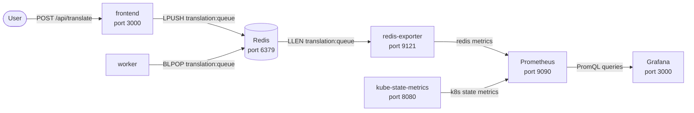

# Lab 01: Setup — Deploying the Stack

> **Assumed knowledge:** You are comfortable with Kubernetes core concepts (Deployments, Services, ConfigMaps) and have `kubectl`, `helm`, and a local Kubernetes cluster available.

## 📝 Overview & Concepts

This lab series uses a **translation service** as a running example. Users submit text via a frontend; the frontend pushes jobs to a Redis list; a worker pops and translates them offline using a local engine.



In later labs you will add prometheus-adapter to bridge the queue depth metric into the Kubernetes autoscaling API, and configure an HPA that scales the worker based on queue backlog.

All starter manifests are in the `starter/` folder. metrics-server is the only prerequisite that must be installed separately.

## 📋 Tasks

**1. Install metrics-server**

The CPU HPA demonstration in lab 02 requires the `metrics.k8s.io` API, served by metrics-server. Most local clusters do not ship with it.

Install using the official manifest:

```bash
kubectl apply -f https://github.com/kubernetes-sigs/metrics-server/releases/latest/download/components.yaml
```

On local clusters (Kind, k3d, kubeadm) the kubelet uses a self-signed TLS certificate. Patch metrics-server to skip TLS verification:

```bash
kubectl patch deployment metrics-server \
  -n kube-system \
  --type=json \
  -p='[{"op":"add","path":"/spec/template/spec/containers/0/args/-","value":"--kubelet-insecure-tls"}]'
```

> **Minikube only:** use the built-in addon instead:
>
> ```bash
> minikube addons enable metrics-server
> ```

Wait for metrics-server to become ready:

```bash
kubectl -n kube-system rollout status deployment metrics-server
```

Verify the Metrics API is available:

```bash
kubectl top nodes
```

You should see CPU and memory figures for the node. If you see `error: Metrics API not available`, the rollout is not complete — wait a few seconds and retry.

**2. Deploy the base stack**

```bash
kubectl apply -k starter/
```

Wait for all pods to reach `Running`:

```bash
kubectl -n app get pods --watch
```

Expected pods: `frontend`, `worker`, `redis`, `redis-exporter`, `prometheus`, `kube-state-metrics`, `grafana`.

**3. Verify the Prometheus scrape pipeline**

Verify the pipeline from source to Prometheus before generating any load.

**3a. Check redis-exporter directly**

Port-forward to redis-exporter:

```bash
kubectl -n app port-forward svc/redis-exporter 9121:9121
```

In a new terminal, query the metrics endpoint:

```bash
curl -s http://localhost:9121/metrics | grep redis_key_size
```

You should see:

```
redis_key_size{db="db0",key="translation:queue"} 0
```

The value is `0` because the queue is empty. The important thing is that the series is present. If nothing appears, confirm `REDIS_EXPORTER_CHECK_SINGLE_KEYS=translation:queue` is set in `starter/redis.yaml` and the redis-exporter pod is running:

```bash
kubectl -n app get pods -l app.kubernetes.io/name=redis-exporter
```

You can stop the redis-exporter port-forward once confirmed.

**3b. Confirm Prometheus is scraping redis-exporter**

Port-forward to Grafana:

```bash
kubectl -n app port-forward svc/grafana 3002:3000
```

Open [http://localhost:3002](http://localhost:3002) and log in with `admin` / `admin`. Navigate to **Explore** (compass icon in the left sidebar). The Prometheus datasource is pre-configured.

Run this query:

```
redis_key_size
```

You should see `redis_key_size{key="translation:queue"}` with value `0`. This confirms Prometheus is scraping redis-exporter and the full pipeline is working. If you see no data, check the redis-exporter pod:

```bash
kubectl -n app get pods -l app.kubernetes.io/name=redis-exporter
```

Keep this Grafana port-forward running — you will use it throughout the remaining labs.
