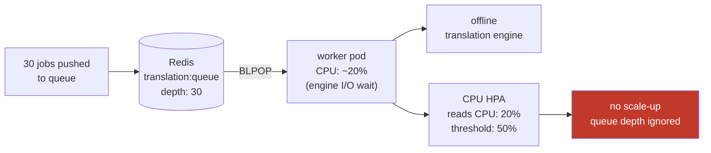

# Lab 02: The CPU Blind-Spot

> **Assumed knowledge:** You have completed Lab 01 and the base stack is running in namespace `app`.

## 📝 Overview & Concepts

In the CPU HPA lab, scaling on CPU worked because there was a direct causal relationship: more HTTP requests → more compute → higher CPU utilization. Queue workers break that assumption.

A worker processing jobs from a Redis list spends most of its time waiting — in this case, on a local translation engine call:

```python
while True:
    job = redis.blpop("translation:queue", timeout=1)
    if job:
        result = translation_engine.translate(job)
        redis.set(result_key, result)
```

The worker thread blocks while the engine runs. Add 50 jobs to the queue and CPU barely moves. A CPU HPA watching 5% utilization against a 50% threshold concludes everything is fine — while users wait minutes for their translations.



**CPU measures compute pressure. Queue depth measures work backlog.** For a worker draining a backlog, queue depth is the right signal. The next labs wire up that signal.

## 📋 Tasks

**1. Demonstrate the CPU blind-spot**

Apply the CPU-targeting HPA:

```bash
kubectl apply -f hpa/hpa-cpu.yaml
```

Make sure the frontend port-forward is active:

```bash
kubectl -n app port-forward svc/frontend 3001:3000
```

In a new terminal, send a burst of translation jobs:

> The worker supports three target languages: `es` (Spanish), `fr` (French), and `de` (German).

```bash
./utils/generate-traffic.sh
```

Watch the HPA and pod CPU. You can also open the **HPA Queue — Worker Scaling** dashboard in Grafana ([http://localhost:3002/d/hpa-queue-worker](http://localhost:3002/d/hpa-queue-worker)) to see the queue depth rising while the replica count stays flat at 1:

```bash
kubectl -n app get hpa worker-cpu-hpa --watch
```

```bash
kubectl -n app top pods
```

Observe that CPU stays low even as the queue fills. The worker's translation engine is local, so CPU usage stays well below the 50% threshold. The HPA does not scale.

When you are done observing, delete the CPU HPA:

```bash
kubectl delete -f hpa/hpa-cpu.yaml
```

## 🤖 AI Checkpoint

**Why CPU fails for queue workers:**

Ask your AI assistant: "I have a Kubernetes worker that processes jobs from a Redis list using BLPOP. I configured a CPU-based HPA targeting 50% utilization, but the HPA never scaled up even when there were 50 jobs waiting in the queue. Why does this happen, and what metric would be more appropriate?"

**What to evaluate:** Does it explain that queue workers spend most of their time in I/O wait rather than executing CPU instructions, so CPU stays low regardless of queue depth? Does it identify queue depth as the right signal because it directly measures unprocessed work backlog? Does it mention that custom metrics are needed since the standard `metrics.k8s.io` API only covers CPU and memory?
