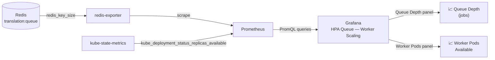

# Lab 03: Observing Metrics with Grafana

> **Assumed knowledge:** You have completed Labs 01 and 02. The base stack is running in namespace `app` with Grafana port-forwarded to [http://localhost:3002](http://localhost:3002).

## 📝 Overview & Concepts

To understand autoscaling decisions, you need visibility into the signals driving them. This lab introduces the **HPA Queue — Worker Scaling** dashboard, which is pre-provisioned in Grafana when the stack deploys. It shows the two metrics that matter most in this series:



| Panel                 | Metric                                                           | Source             |
| --------------------- | ---------------------------------------------------------------- | ------------------ |
| Queue Depth (jobs)    | `redis_key_size{key="translation:queue"}`                        | redis-exporter     |
| Worker Pods Available | `kube_deployment_status_replicas_available{deployment="worker"}` | kube-state-metrics |

> **Why no CPU panel?** CPU usage metrics require cadvisor scraping, which is not part of this lab's stack. The two panels above are sufficient to observe both the problem (queue growing while replicas stay flat) and the solution (replicas scaling with queue depth).

The dashboard auto-refreshes every 5 seconds and retains a 15-minute history — long enough to see the full scale-up and scale-down cycle in a single view.

## 📋 Tasks

**1. Open the dashboard**

Navigate to the dashboard directly:

[http://localhost:3002/d/hpa-queue-worker](http://localhost:3002/d/hpa-queue-worker)

Or from the Grafana home page: click the grid icon (Dashboards) in the left sidebar and select **HPA Queue — Worker Scaling**.

You should see two side-by-side time series panels. Both will show flat lines at `0` (queue) and `1` (replica) if no jobs are in flight.

**2. Verify auto-refresh is active**

Confirm the refresh interval shown in the top-right of the page (next to the time range picker) reads **5s**. The dashboard is provisioned with this default. If it shows **Off**, click the dropdown and select **5s**.

**3. Generate load and watch the panels update**

Make sure the frontend port-forward is active:

```bash
kubectl -n app port-forward svc/frontend 3001:3000
```

Send a burst of jobs in a new terminal:

```bash
./utils/generate-traffic.sh
```

Watch the **Queue Depth** panel spike as jobs arrive. The **Worker Pods Available** panel will stay at `1` because no queue-based HPA is configured yet — this is the CPU blind-spot from lab 02 visualized.

Once all jobs process, both panels return to their baseline values.

**4. Keep the session running**

Leave Grafana open for the remaining labs. In lab 05 you will see the **Worker Pods Available** panel respond to the queue HPA scaling the worker up and back down.
