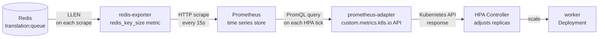

# Lab 04: Wiring the Custom Metrics Pipeline

> **Assumed knowledge:** You have completed Labs 01–03. The base stack is running with Grafana available at [http://localhost:3002](http://localhost:3002).

## 📝 Overview & Concepts

### The Three Kubernetes Metrics APIs

HPA can read from three metric API layers. Each serves a different category of signal:

| API                       | Signal type                                                                    | Served by                        | HPA metric type  |
| ------------------------- | ------------------------------------------------------------------------------ | -------------------------------- | ---------------- |
| `metrics.k8s.io`          | CPU and memory per pod/node                                                    | metrics-server                   | `Resource`       |
| `custom.metrics.k8s.io`   | App-level metrics attached to Kubernetes objects                               | an adapter (prometheus-adapter)  | `Object`, `Pods` |
| `external.metrics.k8s.io` | Metrics from outside the cluster (SQS queue depth, Datadog metrics, and so on) | an adapter with external support | `External`       |

The Redis queue lives inside the cluster and can be attached to a Kubernetes object (the `redis` Service), so we use `custom.metrics.k8s.io`.

### The Custom Metrics Pipeline

Getting queue depth into the HPA's hands requires four components working in sequence:



If any link in this chain breaks, HPA reports `<unknown>` and refuses to scale. The tasks below verify each stage before proceeding.

### How redis-exporter Exposes Queue Depth

By default, `redis_exporter` does not track specific key sizes. You opt in with `REDIS_EXPORTER_CHECK_SINGLE_KEYS`:

```yaml
env:
  - name: REDIS_EXPORTER_CHECK_SINGLE_KEYS
    value: 'translation:queue'
```

This tells the exporter to call `LLEN translation:queue` on each scrape cycle and expose the result as `redis_key_size{key="translation:queue"}`. Multiple keys can be listed as a comma-separated value.

### Prometheus Labels Required by the Adapter

prometheus-adapter matches metric series to Kubernetes objects using label selectors. The metric must carry `namespace` and `service` labels. redis-exporter does not add these by default, so they are injected via `metric_relabel_configs` in `starter/prometheus-config.yaml`:

```yaml
metric_relabel_configs:
  - target_label: service
    replacement: redis
  - target_label: namespace
    replacement: app
```

This runs after each scrape and appends `service="redis"` and `namespace="app"` to every metric from the redis-exporter job. The adapter uses those labels to match the metric to the `redis` Service in the `app` namespace.

### The prometheus-adapter Rule

The metric rule in `starter/prometheus-adapter-values.yaml` maps the raw Prometheus series to a named custom metric that HPA can query:

```yaml
- seriesQuery: '{__name__="redis_key_size", namespace="app", service="redis"}'
  resources:
    overrides:
      namespace: { resource: namespace }
      service: { resource: service }
  name:
    matches: 'redis_key_size'
    as: 'translation_queue_length'
  metricsQuery: 'redis_key_size{key="translation:queue", <<.LabelMatchers>>}'
```

| Field                 | Why it matters                                                                                                                                                                                                                                                                                                                                                                                                                                         |
| --------------------- | ------------------------------------------------------------------------------------------------------------------------------------------------------------------------------------------------------------------------------------------------------------------------------------------------------------------------------------------------------------------------------------------------------------------------------------------------------ |
| `seriesQuery`         | The adapter uses this to discover which series it should expose. Including `namespace` and `service` here prevents it from accidentally surfacing other `redis_key_size` series from different clusters or jobs that may end up in the same Prometheus — without this filter, a misconfigured scrape job in another namespace could pollute the custom metric.                                                                                         |
| `resources.overrides` | HPA requests metrics by Kubernetes resource identity, not by Prometheus label value. The overrides bridge that gap: they tell the adapter "when HPA asks for this metric scoped to `service=redis`, look for series where the `service` label is `redis`." Without this mapping, the adapter cannot scope the metric to a specific object and HPA cannot target it.                                                                                    |
| `name`                | Prometheus metric names are internal implementation details. Exposing `redis_key_size` directly to HPA would couple the autoscaling configuration to the exporter's naming. Renaming it `translation_queue_length` makes the HPA config describe business intent — if the exporter is ever swapped out, the HPA manifest does not need to change.                                                                                                      |
| `metricsQuery`        | `seriesQuery` is only used for discovery. This is the actual PromQL run on each HPA evaluation cycle. The `key="translation:queue"` filter is critical here: redis-exporter can track multiple keys, and without it the query would return the size of every tracked key rather than just the queue. `<<.LabelMatchers>>` lets the adapter inject the correct namespace and service at query time so a single rule works across multiple environments. |

## 📋 Tasks

**1. Verify the `redis_key_size` metric in Grafana**

You may still have jobs in the queue from lab 02. In Grafana Explore ([http://localhost:3002](http://localhost:3002)), run:

```
redis_key_size{key="translation:queue"}
```

Note the current value — this is the raw signal we will expose to HPA.

Also confirm the `service` and `namespace` labels are present (expand the metric row to inspect all labels):

```
redis_key_size{key="translation:queue", namespace="app", service="redis"}
```

If those labels are missing, check the `metric_relabel_configs` section in `starter/prometheus-config.yaml` and re-apply:

```bash
kubectl apply -k starter/
```

**2. Install prometheus-adapter via Helm**

prometheus-adapter registers itself as an extension API server for `custom.metrics.k8s.io`. Install it with the provided values file, which maps `redis_key_size` to the named custom metric `translation_queue_length`:

```bash
helm repo add prometheus-community https://prometheus-community.github.io/helm-charts
helm repo update
```

```bash
helm upgrade prometheus-adapter prometheus-community/prometheus-adapter \
  --namespace app \
  --version 5.3.0 \
  --install \
  --values starter/prometheus-adapter-values.yaml
```

Wait for the adapter to become ready:

```bash
kubectl -n app get pods -l app.kubernetes.io/name=prometheus-adapter --watch
```

> ⚠️ The adapter registers an `APIService` with the Kubernetes API server. This registration can take 30–60 seconds after the pod starts. If the next step returns an error, wait and retry.

**3. Verify the custom metric is available**

Confirm `translation_queue_length` is registered in the Kubernetes custom metrics API:

```bash
kubectl get --raw "/apis/custom.metrics.k8s.io/v1beta1/" | jq '.resources[].name' | grep translation
```

You should see `services/translation_queue_length` in the output.

Fetch the current value directly:

```bash
kubectl get --raw \
  "/apis/custom.metrics.k8s.io/v1beta1/namespaces/app/services/redis/translation_queue_length" \
  | jq .
```

The `value` field should reflect the current queue depth. A value of `"0"` is expected if the queue has already drained.

## 🤖 AI Checkpoint

**The adapter's role:**

Ask: "What does prometheus-adapter do, and why is it needed? Can't the HPA read from Prometheus directly?"

**What to evaluate:** Does it explain that HPA can only query the Kubernetes metrics APIs (`metrics.k8s.io`, `custom.metrics.k8s.io`, `external.metrics.k8s.io`) and has no direct Prometheus connection? Does it describe prometheus-adapter as an API extension server that translates Kubernetes API queries into PromQL and returns the results? Does it explain that this adapter pattern lets any metrics backend plug in, not just Prometheus?
