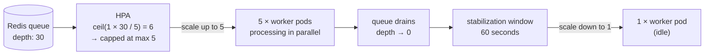

# Lab 05: Queue-Based HPA in Action

> **Assumed knowledge:** You have completed Labs 01–04. The custom metric `translation_queue_length` is registered and returning values. Grafana is available at [http://localhost:3002](http://localhost:3002).

## 📝 Overview & Concepts

### HPA Object Metric Type

With the custom metric registered, the HPA targets it using the `Object` type. Unlike the `Pods` type (which averages a metric across all pods), `Object` reads a single value from one Kubernetes object — here, the current depth of the Redis queue:

```yaml
metrics:
  - type: Object
    object:
      metric:
        name: translation_queue_length
      describedObject:
        apiVersion: v1
        kind: Service
        name: redis
      target:
        type: Value
        value: '5'
```

### The Scaling Formula

HPA calculates the desired replica count with:

$$\text{desiredReplicas} = \left\lceil \text{currentReplicas} \times \frac{\text{currentMetricValue}}{\text{desiredMetricValue}} \right\rceil$$

With `target.value: "5"`, one worker per 5 queued jobs is the ratio. At 30 jobs queued with 1 replica running:

$$\left\lceil 1 \times \frac{30}{5} \right\rceil = 6 \rightarrow \text{capped at maxReplicas} = 5$$



Choosing the right `target.value` is a tradeoff: a lower value scales more aggressively (lower queue latency, higher cost); a higher value is more conservative. Start high and tune based on observed drain rates.

## 📋 Tasks

> **Try with AI:** Before writing the HPA manifest, try generating it with your AI assistant using this prompt: _"I have a queue-based worker Deployment called `worker` in namespace `app`. I want to scale it with HPA based on a custom metric `translation_queue_length` provided by prometheus-adapter. The metric is attached to the `redis` Service. Write the HPA manifest using `autoscaling/v2` with a minimum of 1 replica, a maximum of 5, and a target value of 5 jobs per replica."_ Review the output before applying and verify that `describedObject.kind` is `Service` and `describedObject.name` is `redis`.

**1. Write and apply the HPA**

Create a file called `hpa-queue.yaml` with the following content:

```yaml
apiVersion: autoscaling/v2
kind: HorizontalPodAutoscaler
metadata:
  name: worker
  namespace: app
spec:
  scaleTargetRef:
    apiVersion: apps/v1
    kind: Deployment
    name: worker
  minReplicas: 1
  maxReplicas: 5
  metrics:
    - type: Object
      object:
        metric:
          name: translation_queue_length
        describedObject:
          apiVersion: v1
          kind: Service
          name: redis
        target:
          type: Value
          value: '5'
  behavior:
    scaleDown:
      stabilizationWindowSeconds: 60
```

The `stabilizationWindowSeconds: 60` shortens the scale-down hold period so the full scale-up and scale-down cycle is visible within the demo window.

Apply it:

```bash
kubectl -n app apply -f hpa-queue.yaml
```

Confirm the HPA is reading the custom queue metric (not CPU):

```bash
kubectl -n app get hpa worker
```

**2. Generate load and watch the worker scale**

Make sure the frontend port-forward is still active:

```bash
kubectl -n app port-forward svc/frontend 3001:3000
```

Send a burst of translation jobs:

```bash
./utils/generate-traffic.sh
```

In Grafana, open the **HPA Queue — Worker Scaling** dashboard ([http://localhost:3002/d/hpa-queue-worker](http://localhost:3002/d/hpa-queue-worker)). Watch the **Queue Depth** panel rise as jobs pile up, and **Worker Pods Available** jump to 5 as the HPA fires.

Watch the HPA react to the rising queue depth:

```bash
kubectl -n app get hpa worker --watch
```

```bash
kubectl -n app get pods -n app --watch
```

With 30 jobs queued and a target of 5, the HPA should scale the worker to the maximum of 5 replicas.

**3. Observe scale-down after the queue drains**

Once the workers process the backlog, the queue depth drops to 0. Watch the replica count hold during the 60-second stabilization window, then drop back to 1 as HPA confirms the queue has stayed empty. Both panels update automatically every 5 seconds. kube-state-metrics (deployed as part of the starter stack) provides the `kube_deployment_status_replicas_available` metric.

You can also poll the queue depth directly via the custom metrics API:

```bash
watch -n 5 kubectl get --raw \
  "/apis/custom.metrics.k8s.io/v1beta1/namespaces/app/services/redis/translation_queue_length" \
  | jq '.items[0].value'
```

**4. Clean up**

```bash
kubectl -n app delete -f hpa-queue.yaml
kubectl delete -k starter/
helm uninstall prometheus-adapter -n app
```

## 🤖 AI Checkpoints

**Choosing the target value:**

Ask: "Our HPA targets a value of `5` for `translation_queue_length`. We currently have 1 worker pod running and the queue depth is 30. How many replicas will HPA request? What would happen if we set the target to `1` instead of `5`?"

**What to evaluate:** Does it calculate correctly: ceil(1 × (30 / 5)) = 6, capped at maxReplicas=5? Does it explain that a target of `1` would scale to maxReplicas immediately with even a small queue? Does it discuss the tradeoff between aggressive low-latency scaling and conservative cost control?

**KEDA as an alternative:**

Ask: "I've heard of KEDA as an alternative to prometheus-adapter for event-driven scaling. What is it, and when would you choose KEDA over prometheus-adapter?"

**What to evaluate:** Does it explain that KEDA is a Kubernetes operator with pre-built scalers for common event sources (Redis, Kafka, RabbitMQ, SQS, and so on) and a `ScaledObject` CRD that replaces both the HPA and the adapter? Does it note that KEDA is simpler for common use cases since it avoids configuring an adapter? Does it mention that prometheus-adapter is more flexible for arbitrary Prometheus metrics that KEDA does not have a dedicated scaler for?

## 📚 Resources

- [prometheus-adapter GitHub](https://github.com/kubernetes-sigs/prometheus-adapter)
- [HPA with custom metrics (Kubernetes docs)](https://kubernetes.io/docs/tasks/run-application/horizontal-pod-autoscale/#scaling-on-custom-metrics)
- [redis_exporter documentation](https://github.com/oliver006/redis_exporter)
- [KEDA documentation](https://keda.sh/docs/)
- [Kubernetes custom metrics API](https://github.com/kubernetes/metrics/blob/master/IMPLEMENTATIONS.md)
